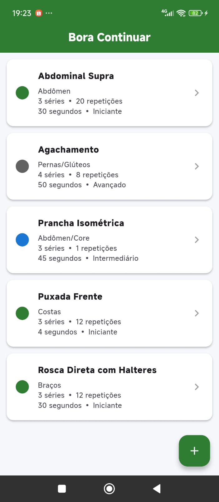
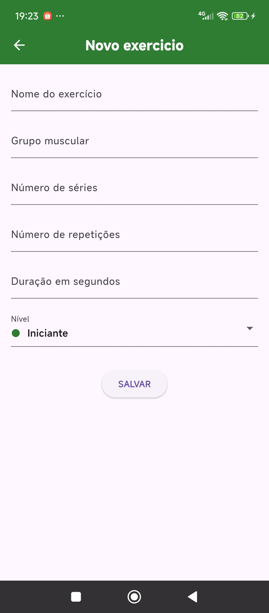
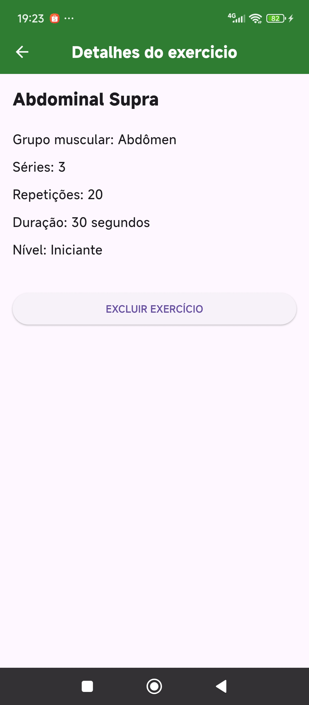
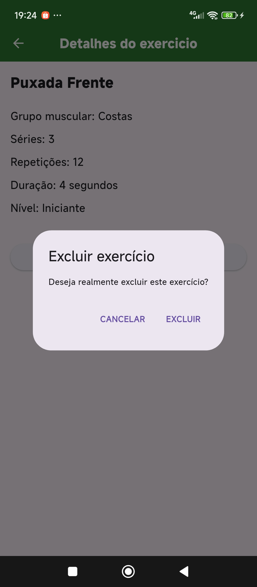

## Telas do aplicativo






# 🏋️‍♂️ Bora Continuar

O **Bora Continuar** é um aplicativo mobile desenvolvido em Flutter para o gerenciamento e acompanhamento de rotinas de exercícios de academia. O projeto foca em uma experiência visual limpa e direta para o usuário durante o treino, utilizando persistência local com SQLite.

---

## 📋 Requisitos do Enunciado Atendidos

- [x] **Tema Livre:** Gerenciador de treinos e rotinas de exercícios físicos.
- [x] **Lista Principal:** Listagem dinâmica que consome e exibe os dados diretamente do banco de dados local.
- [x] **Múltiplas Informações por Item:** Cada exercício exibe de forma clara o nome, grupo muscular, séries, repetições, duração em segundos e o nível.
- [x] **Estrutura de 3 Telas:**
  - `TodoList`: Tela principal responsável por listar as rotinas salvas.
  - `Cadastro`: Tela com formulário completo para a inserção de novos exercícios.
  - `Detalhes`: Tela para visualização expandida de um item clicado, contendo a confirmação segura para exclusão.
- [x] **Persistência Local:** Armazenamento seguro de dados utilizando o banco de dados **SQLite**.

---

## 📁 Estrutura de Pastas do Projeto

O código-fonte está estruturado de forma organizada dentro do diretório `lib/`, separando rigidamente as responsabilidades de interface, modelo de dados e persistência:

```text
lib/
├── model/
│   └── exercicio.dart       # Encapsulamento, Getters/Setters e Conversores (Map/Objeto).
├── screens/
│   ├── cadastro.dart        # Formulário de entrada com Dropdown de nível colorido.
│   ├── detalhes.dart        # Tela estática para inspeção e exclusão com AlertDialog.
│   └── todolist.dart        # Dashboard principal com a ListView e tags de cores.
├── util/
│   └── dbhelper.dart        # Padrão Singleton e queries SQL (CRUD) do SQLite.
└── main.dart                # Inicializador global e configuração do MaterialApp.
```

---

## 🛠️ Tecnologias Utilizadas

- **Linguagem de Programação:** Dart
- **Framework Mobile:** Flutter (Stateful e Stateless Widgets)
- **Banco de Dados Relacional:** SQLite (através do plugin `sqflite`)
- **Gerenciamento de Estado:** Nativo (utilizando estruturas de `setState`)

---

### 🎓 Contexto Acadêmico

Este aplicativo foi desenvolvido com foco em aprendizado prático para o **Curso de Especialização em Desenvolvimento de Sistemas para Dispositivos Móveis** do **IFSP (Instituto Federal de Educação, Ciência e Tecnologia de São Paulo) - Campus São Carlos**.

**Professor:** Carlão  
**Aluna:** Vania Godoy 

